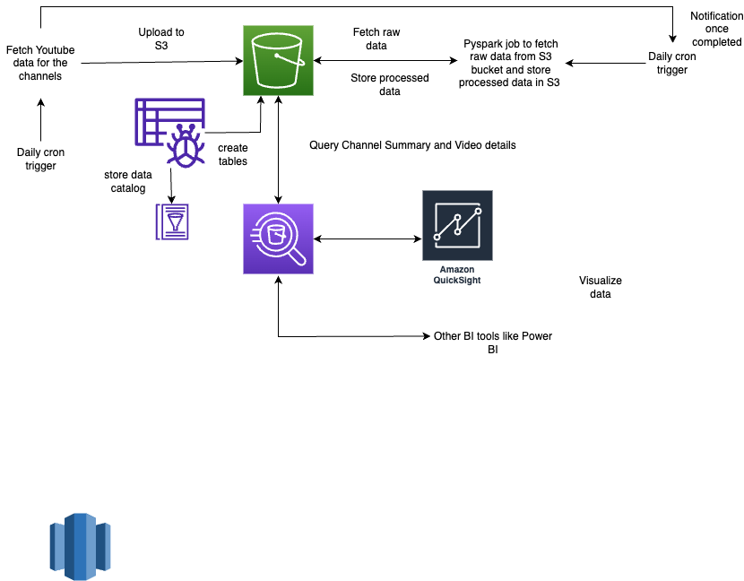

# sph-youtube-test
This repository is created to fetch data from Youtube's API v3 for different channels and it's playelist items and process it
to store in tables like channel summary and playlist data as per channel.
Data is stored in raw as well as processed form using scripts and AWS services like S3, Glue Crawler, SNS, etc.

